# intelligent-it-help-desk-automation-and-classification
This project aims to build a pipeline that automatically processes incoming messages to an IT department. The goal is to create a system that classifies requests by routing clear, script-readable information to a rule-based engine (Regex) and sending ambiguous cases to an LLM.

Initially, a classification system that processes messages seems quite straightforward in theory. We set up rules for regex, it collects messages based on keywords, and then messages that were not processed need to be passed to an LLM. It seems very simple, but during implementation, additional questions arise. 

Before getting start, let me outline the input data and requirements here.

Input Data: Connection problem, Hardware request, Access error, Access request, I'am getting an error message, Mail group addition, Report request, System error, Server unreachable, Application not working, VPN connection problem, VPN access request, Software installation, New user request, Permission request. 

The dataset Console-AI/IT-helpdesk-synthetic-tickets from Hugging Face will be used. It contains 500 rows and 7 columns. Appeared to be a good fit for the project.

The system is designed with 3 key stages:

Stage 1: Pre-Classification with Regex

In this stage, incoming IT department requests are processed by a python script using Regular Expressions. The script splits messages into two primary categories "ERROR" and "REQUEST". Classification is based on keyword matching, messages containing "problem", "error", "not working", "unreachable", "issue" are tagged as ERROR; those with "request", "addition", "installation" are tagged as REQUEST.

Stage 2: Hybrid Workflow Design

For this stage, a logical workflow deagram must be created and explained. The diagram must imclude:
- Data input — incoming messages to the IT departmant
- Regex processing — messages are first classified as ERROR or REQUEST
- Routing to AI model — cases that cannot be processed by regex are sent to an Artificial Intelligence model for futher classification
- Final category assignment — after both regex and AI processing, each message is labeled with its final category

Stage 3: LLM Prompt Engineering

The focus is on prompt enfineering. An effective instructin for the AI model must be written to ensure the generated response meets all requirements. Specifically, the model must accurately determine the correct category for emails labeled as ambiguous by the Regex filter. The categories that must be included in the prompt are: Network, Software, Account, Training, Security, Licensing, Communication, RemoteWork, HardWare, Infrastructure, Performance. 


## Data Preprocessing

I started the code with data preprocessing using the Console-AI/IT-helpdesk-synthetic-tickets dataset from Hugging Face. The dataset is ready-to-use and even allows me to verify my results against the categories provided by the LLM later. 

To the dataset, I added 9 messages from my exam. I transited all the data into a new table with 3 columns: id, subject, and description. As an example, here is the first row from dataset:

| id | subject | description |
| :--- | :--- | :--- |
| 1aiu3lrqi | Hey IT! Our network printer keeps disconnecting. | Hey IT! Our network printer keeps disconnecting intermittently and requires manual IP reconfiguration each time. It's becoming quite a hassle, especially during busy hours. A few folks in the office have mentioned they're experiencing the same issue. Could you look into this? Thanks! |

I have not explored entire dataset yet. This will likely be necessary when I get to the prompt engineering stage. I am already thinking about how I will need to analyze the messages and write effective instructions for the classification task.

## Pre-classification with Regex

Next, I code a regex function in python:
```python
def classify_message(text):
    text = text.lower()
    if re.search(error_pattern, text):
        return 'Error'
    elif re.search(request_pattern, text):
        return 'Request'
    else:
        return 'Ambiguous'
```

- For `error_pattern`, I used the keywords: problem, error, not working, and issue;
- For `request_pattern`, I used the keywords: request, addition, and installation.

Then, I applied `classify_message` function to the `description` column of my dataset. Ambiguous 327, Error 120, and Request 62 were the result of processing. 

## Hybrid Workflow design

I started the workflow design by deciding to use the Mermaid function for visualization purposes. I will begin by explaining the terms outlined in Stage 2: Data input, Regex processing, Routing to AI model, and Final category assignment.

Incoming IT help desk tickets enter the system. Each ticket is processed by a Python regex script that checks for keywords using error_pattern and request_pattern. If no keywords match, the ticket is marked as "Ambiguous". These ambiguous tickets are then sent to an AI model for deeper analysis. The AI model follows a carefully engineered prompt and classifies each ambiguous ticket into one of eleven categories. In the final step, tickets from regex plus tickets from the LLM are combined and stored with their final classification.

Below, I present a diagram for visual understanding:

```mermaid
graph TD
    A[1. DATA INPUT<br/>IT Help Desk Tickets] --> B{2. REGEX CHECK}
    
    B -->|ERROR Pattern Match| C[🔴 ERROR]
    B -->|REQUEST Pattern Match| D[🟢 REQUEST]
    B -->|AMBIGUOUS / No Match| E[🟡 AMBIGUOUS]
    
    E --> F[3. LLM CLASSIFICATION]
    
    subgraph "LLM Detailed Categories"
    F -.-> F1[Network]
    F -.-> F2[Software]
    F -.-> F3[Account]
    F -.-> F4[Training]
    F -.-> F5[Security]
    F -.-> F6[Licensing]
    F -.-> F7[Communication]
    F -.-> F8[RemoteWork]
    F -.-> F9[HardWare]
    F -.-> F10[Infrastructure]
    F -.-> F11[Performance]
    end
    
    C --> G[4. FINAL CATEGORY ASSIGNMENT]
    D --> G
    F1 --> G
    F2 --> G
    F3 --> G
    F4 --> G
    F5 --> G
    F6 --> G
    F7 --> G
    F8 --> G
    F9 --> G
    F10 --> G
    F11 --> G
    
```



## LLM Prompt Engineering
